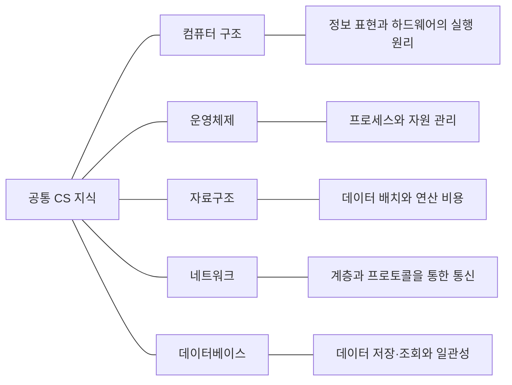

## 공통 CS 지식의 다섯 분야

 

| 분야 | 무엇을 공부하나 | 학습 지도 |
|---|---|---|
| 컴퓨터 구조 | 데이터와 명령어의 표현, CPU·메모리·입출력장치의 동작 | [컴퓨터 구조 학습 지도]() |
| 운영체제 | 프로세스와 스레드, 하드웨어 자원의 할당과 관리 | [운영체제 학습 지도]() |
| 자료구조 | 데이터의 배치 방식과 연산의 시간·공간 비용 | [자료구조 학습 지도]() |
| 네트워크 | 계층과 프로토콜을 통한 컴퓨터 간 통신 | [네트워크 학습 지도]() |
| 데이터베이스 | 데이터 모델, 저장·조회와 일관성 관리 | [데이터베이스 학습 지도]() |
