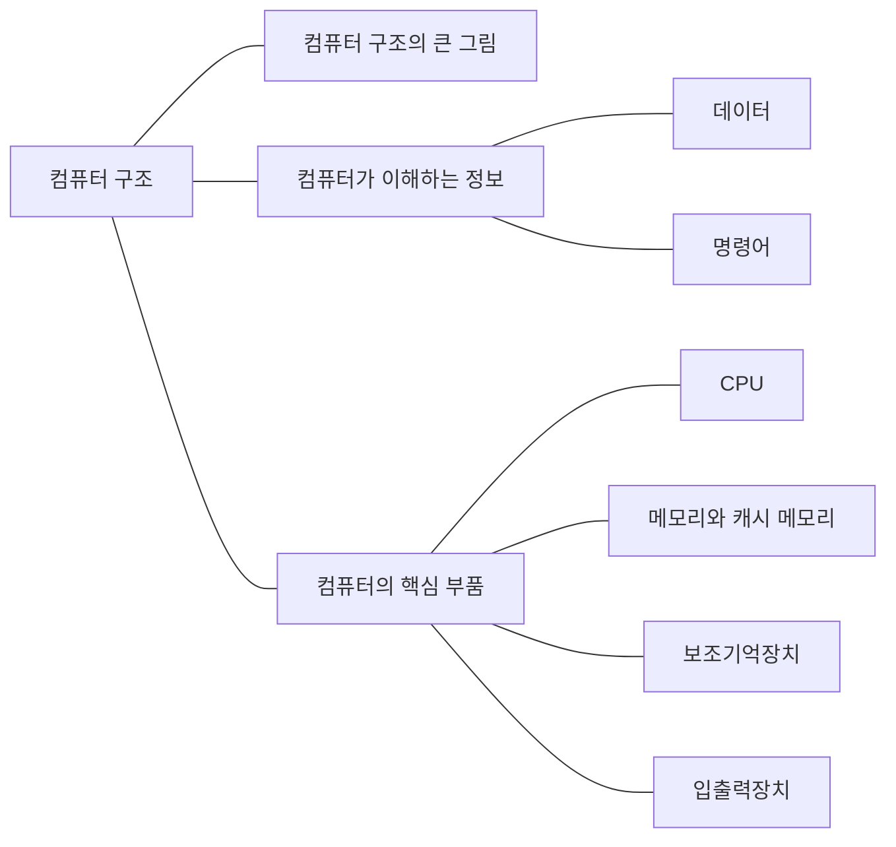

컴퓨터가 데이터를 표현하고 명령어를 실행하는 과정을 공부한다. CPU, 메모리, 저장장치가 각각 어떤 일을 하는지 정리한다.

## 개념 지도

<!-- ## 공부 순서

1. [데이터 표현과 바이트 순서]()
1. [CPU와 명령어 실행]()
1. [메모리 계층과 캐시]()
1. [CPU 성능과 명령어 병렬 처리]()
1. [인터럽트와 DMA]()
1. [RAID와 디스크 장애 대응]() -->

[전체 CS 학습 지도로 돌아가기]()
