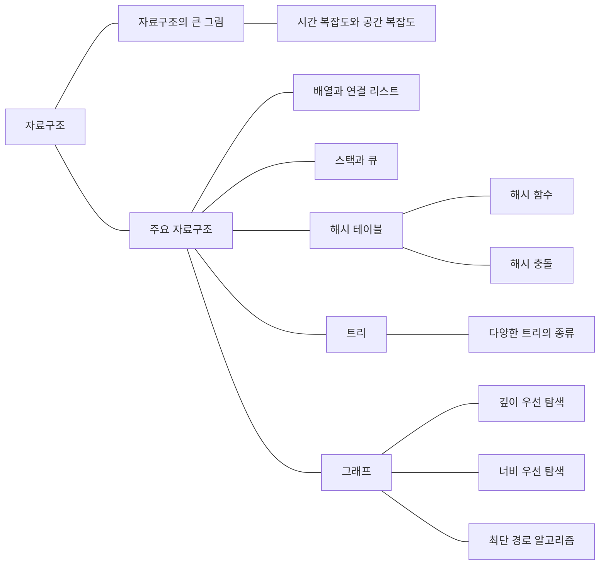

배열, 리스트, 스택, 큐, 트리 등 기본 자료구조를 공부한다. 데이터를 찾거나 추가하고 삭제할 때 드는 비용과, 각 구조를 언제 쓰는지 정리한다.

## 개념 지도

 

## 정렬 알고리즘 시간 복잡도

| 정렬 알고리즘 | 시간 복잡도 |
| :--- | :--- |
| 삽입 정렬 | O(n²) |
| 선택 정렬 | O(n²) |
| 버블 정렬 | O(n²) |
| 병합 정렬 | O(n log n) |
| 퀵 정렬 | O(n log n) |
| 힙 정렬 | O(n log n) |

 

## 주요 알고리즘 시간 복잡도

| 알고리즘 | 시간 복잡도 |
| :--- | :--- |
| 순차 탐색 | O(n) |
| 이진 탐색 | O(log n) |
| 깊이 우선 탐색 | O(V + E) |
| 너비 우선 탐색 | O(V + E) |
| 다익스트라 알고리즘 | O(E log V) |
| 플로이드-워셜 알고리즘 | O(V³) |
| 크루스칼 알고리즘 | O(E log V) |
| 프림 알고리즘 | O(E log V) |

<!-- ## 공부 순서

1. [시간 복잡도와 공간 복잡도]() — 기존 코드 분석과 점근 표기
1. [배열과 연결 리스트]()
1. [스택과 큐]()
1. [해시 테이블과 충돌]()
1. [트리와 탐색]()
1. [그래프 구현 예시: 코딩테스트 심화 템플릿]() -->

[전체 CS 학습 지도로 돌아가기]()
