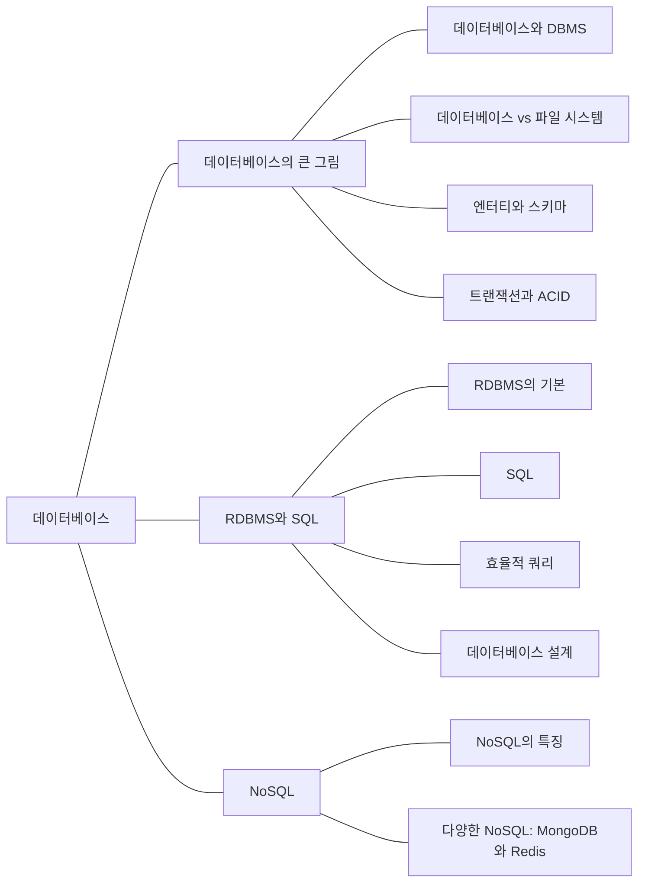

데이터를 테이블에 저장하고 SQL로 조회하는 방법부터 공부한다. 트랜잭션, 인덱스, 테이블 설계와 NoSQL도 정리한다.

## 개념 지도

<!-- ## 공부 순서

1. [관계형 데이터 모델과 키]()
1. [트랜잭션과 ACID]()
1. [SQL: 테이블·데이터 조작부터 JOIN·서브쿼리·뷰까지]()
1. [B+ 트리와 데이터베이스 인덱스]()
1. [정규화와 역정규화]()
1. [NoSQL과 MongoDB·Redis]() -->

[전체 CS 학습 지도로 돌아가기]()
