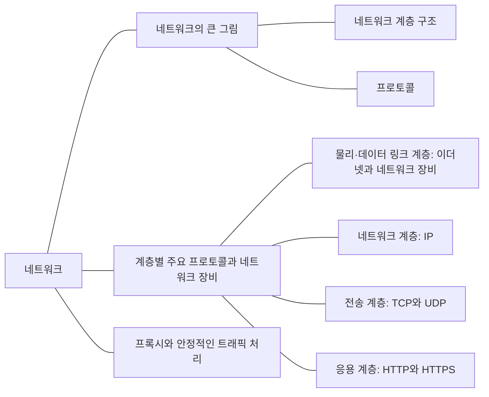

내 컴퓨터에서 보낸 데이터가 상대 컴퓨터에 도착하기까지의 과정을 공부한다. 이 과정에서 IP, TCP, HTTP 같은 프로토콜과 네트워크 장비가 하는 일을 정리한다.

## 개념 지도

<!-- ## 공부 순서

1. [네트워크 계층과 이더넷]()
1. [IP 주소와 패킷 전달]()
1. [TCP와 UDP]()
1. [DNS와 URL]()
1. [HTTP 요청과 상태 관리]()
1. [HTTP 캐시와 조건부 요청]()
1. [HTTPS와 TLS]()
1. [프록시와 부하 분산]() -->

[전체 CS 학습 지도로 돌아가기]()
