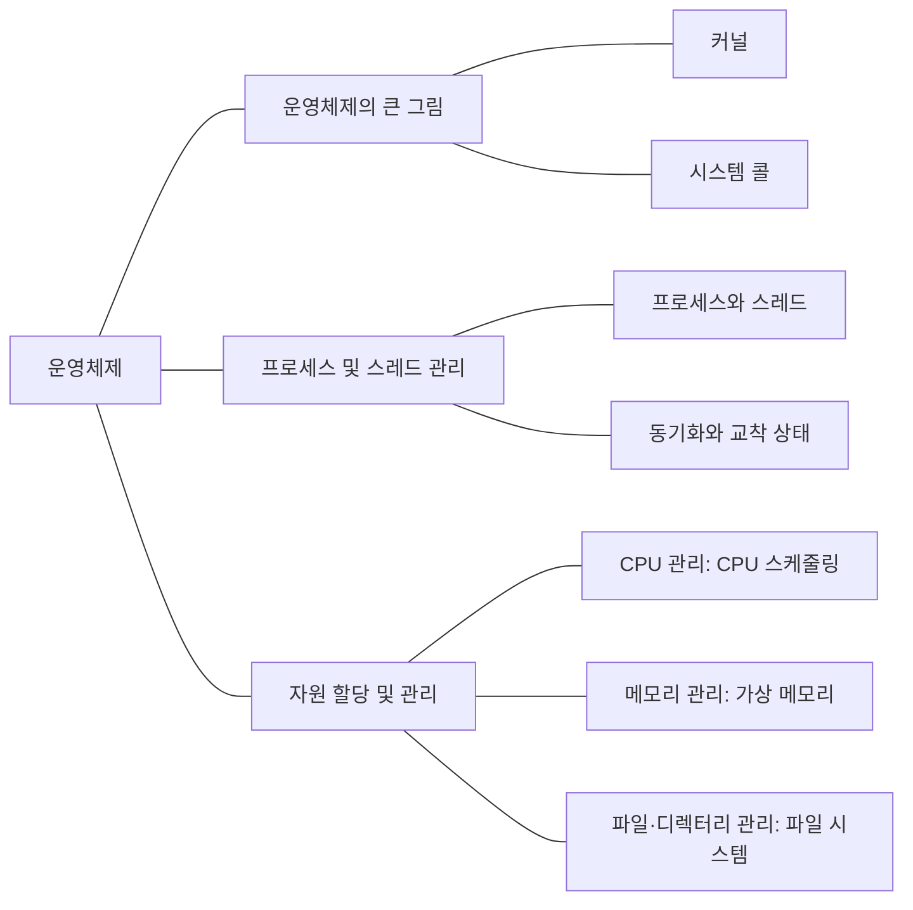

여러 프로그램이 CPU와 메모리를 나눠 쓰는 방식을 공부한다. 프로세스와 스레드, 스케줄링, 동기화, 가상 메모리, 파일 시스템을 정리한다.

## 개념 지도

<!-- ## 공부 순서

1. [커널과 시스템 콜]()
1. [프로세스와 스레드]()
1. [동기화와 교착 상태]()
1. [CPU 스케줄링]()
1. [가상 메모리와 페이징]()
1. [파일 시스템과 링크]() -->

[전체 CS 학습 지도로 돌아가기]()
